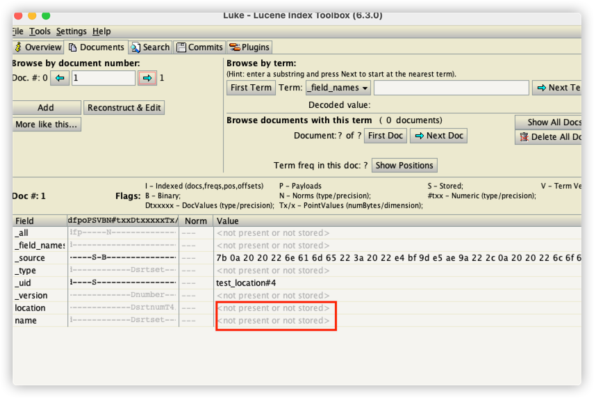

# lucene-index

## tips:
- 以下是我把Elasticsearch的索引文件拉下来通过lucene工具包读取后发现的问题
  - 如果不声明store:true,读不到Elasticsearch自定义字段信息的
    ```json
    {
      "properties": {
        "name": {
          "type": "keyword",
          "store": true
        }
      }
    }
    ```
- Elasticsearch 默认不会开启Field.Store.YES 会把数据存到_source里面 _source是Elasticsearch自定义的字段
- 这点和Solr不同 Solr在schema.xml定义的时候会指定是否索引 是否存储
- 其实通过Luke也可以查看出字段是否存储
- 

